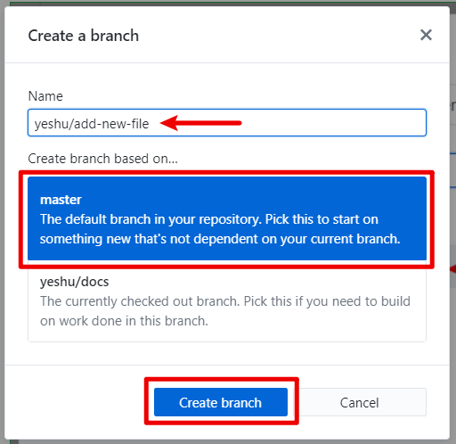
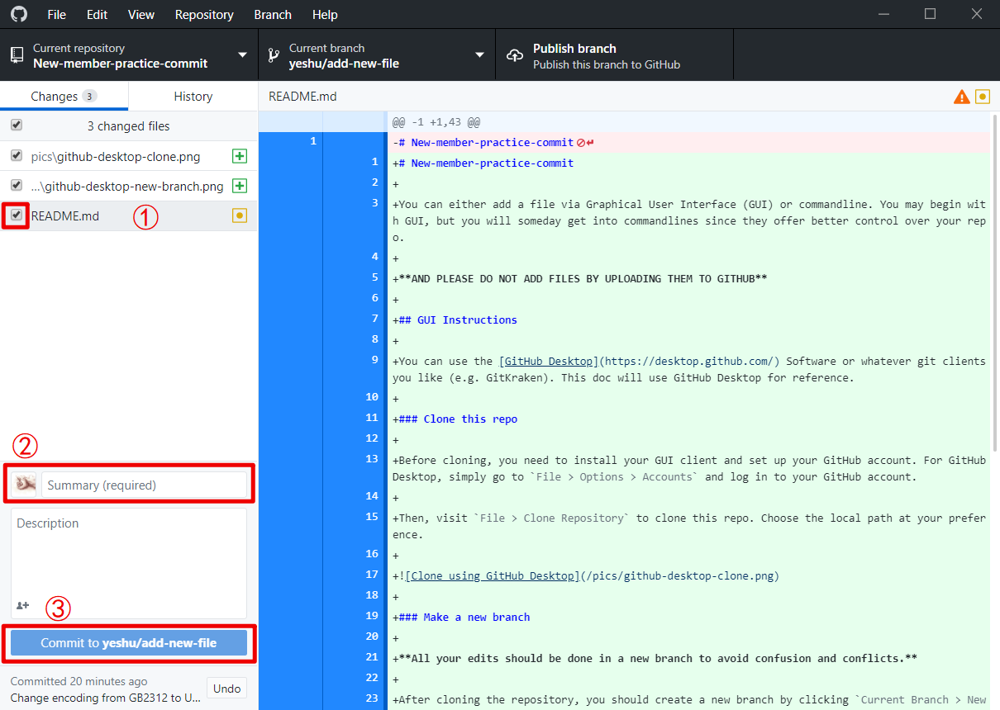

# New-member-practice-commit

You can either add a file via Graphical User Interface (GUI) or commandline. You may begin with GUI, but you will someday get into commandlines since they offer better control over your repo.

**AND PLEASE DO NOT ADD FILES BY UPLOADING THEM TO GITHUB**

## Table of Contents

- [New-member-practice-commit](#new-member-practice-commit)
  - [Table of Contents](#table-of-contents)
  - [GUI Instructions](#gui-instructions)
    - [Clone this repo](#clone-this-repo)
    - [Create a new branch](#create-a-new-branch)
    - [Add file and commit](#add-file-and-commit)
    - [Push branch](#push-branch)
    - [Create Pull Request](#create-pull-request)
  - [Commanline Instructions](#commanline-instructions)
    - [Clone this repo (CLI)](#clone-this-repo-cli)
    - [Create a new branch (CLI)](#create-a-new-branch-cli)
    - [Add File (CLI)](#add-file-cli)
    - [Commit (CLI)](#commit-cli)
    - [Push branch (CLI)](#push-branch-cli)
    - [Create Pull Request (CLI)](#create-pull-request-cli)

## GUI Instructions

You can use the [GitHub Desktop](https://desktop.github.com/) Software or whatever git clients you like (e.g. GitKraken). This doc will use GitHub Desktop for reference.

### Clone this repo

Before cloning, you need to install your GUI client and set up your GitHub account. For GitHub Desktop, simply go to `File > Options > Accounts` and log in to your GitHub account.

Then, visit `File > Clone Repository` to clone this repo. Choose the local path at your preference.


### Create a new branch

**All your edits should be done in a new branch to avoid confusion and conflicts.**

After cloning the repository, you should create a new branch by clicking `Current Branch > New Branch`.

Then, briefly name this new branch as `[your id]/[what you will do]`. in this case, it is `yeshu/add-new-file`.

Do make sure the new branch is based on master branch.



### Add file and commit

In GitHub Desktop, adding and commiting a file is pretty simple:

1. Tick the boxes before the files you'd like to add
2. Write a brief summary (<50 words) for what you've done. You are also recommended to write a longer description for that in the space below.
3. Click commit button



### Push branch

Final steps! Click `publish branches` (or `push origin` if the branch is already published), and your commits are synced to GitHub.com

### Create Pull Request

For your commits to be merged into `master` branch, you need to create a Pull Request on GitHub.com

Please refer to the [official GitHub documentation](https://help.github.com/en/articles/creating-a-pull-request#creating-the-pull-request)

## Commanline Instructions

### Clone this repo (CLI)

```console
$ git clone https://github.com/Computerization/New-member-practice-commit.git
```

### Create a new branch (CLI)

```console
$ git branch yeshu/add-new-file

$ git checkout yeshu/add-new-file
Switched to branch 'yeshu/add-new-file'
```

### Add File (CLI)

Check for current status first

```console
$ git status
On branch yeshu/add-new-file
Changes not staged for commit:
  (use "git add <file>..." to update what will be committed)
  (use "git restore <file>..." to discard changes in working directory)
        modified:   README.md

Untracked files:
  (use "git add <file>..." to include in what will be committed)
        pics/

```

Then add files you would like to commit

```console
$ git add README.md
```

Check your status again

```console
$ git status
On branch yeshu/add-new-file
Changes to be committed:
  (use "git restore --staged <file>..." to unstage)
        modified:   README.md

Untracked files:
  (use "git add <file>..." to include in what will be committed)
        pics/
```

### Commit (CLI)

```console
$ git commit -m "your commit message (shorter than 69 words)"
```

### Push branch (CLI)

```console
$ git push
```

For first time pushing, you will receive an error message. Simply follow the message.

```console
$ git push
fatal: The current branch yeshu/add-new-file has no upstream branch.
To push the current branch and set the remote as upstream, use

    git push --set-upstream origin yeshu/add-new-file

$ git push --set-upstream origin yeshu/add-new-file
```

### Create Pull Request (CLI)

After pushing, you should setup a pull request. Please refer to the section [Create Pull Request](#create-pull-request).
